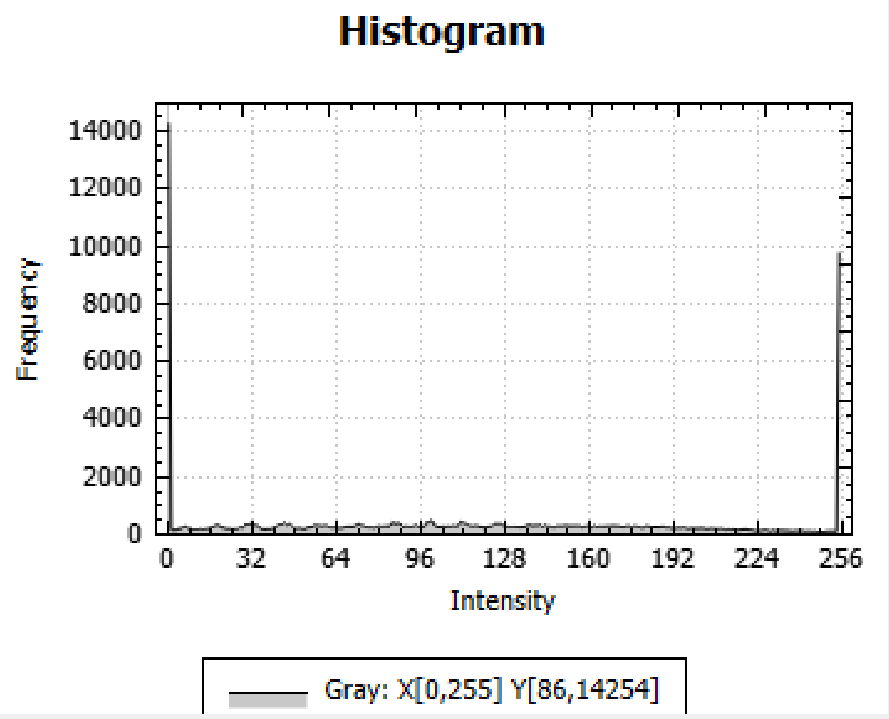

# Image Processing - Stephen Pasch

Written September-October of 2023

**Note for Recruiters:** Since this was part of a class project I have not included my code publicly, if you would like to view it please reach out and request it.

These functions I completed for COMS 4165: Pixel Processing. 
All implemented in C++. Without the use of packages like opencv.
They perform various image-processing tasks for photo editing and other operations. 
Functions headers were provided, but implementation was my own work. 

## Point Operations (image_processing/PointOps)

This folder contains functions that perform point operations on images. Point operations are operations that transform each pixel in an image independently of the other pixels.

The files in this folder are:
- **HW_clip.cpp** : Thresholds values outside of a lower and upper bound, everything in the middle is maintained.
- **HW_contrast.cpp** : Applies a given gain and bias to an image.
- **HW_gamma.cpp** : Performs gamma correction. 
- **HW_histoStretch** : Map all values between a specified upper and lower bound to the full color spectrum.
- **HW_quantize.cpp** : maps the spectrum of each color level to discrete quantized levels. 
- **HW_Threshold.cpp** : performs thresholding operation.
"""

## Neighborhood Operations (image_processing/NeighborOps)

This section contains functions that perform neighborhood operations on images. Neighborhood operations transform each pixel in an image based on the values of its neighboring pixels. 

The files in this folder are:
- **HW_blur.cpp** : 'Convolve' an unweighted box filter of variable width and height. 
- **HW_convolve.cpp** : Convolves any filter matrix specified.
- **HW_errDiffusion.cpp** : Creates a binary image that represents shade with a density of positive points, much like pointillism.
- **HW_median.cpp** : Applies median filtering.
- **HW_sharpen.cpp** : Applies the 'unsharp masking' method imporoving image sharpness. 

### **1. Clip** 

`HW_clip(ImagePtr I1, int t1, int t2, ImagePtr I2)`

"Clips" all image intensities below lower threshold to the lower threshold, and values above the upper threshhold to the upper threshold. All intensity values in between are maintained. This is useful for removing high/low intensities from image.  
Implemented through a look-up-table. O(NxM) NxM is the number of pixels in the image. 

Args:

        I1 (ImagePtr): Pointer to an Input image
        t1 (int) : Lower intensity threshold
        t2 (int) : Upper intensity threshold
        I2 (ImagePtr): Output parameter -> Pointer to an output image.

Below are the imput and output images. Pay attention to their histograms of pixel intensity. In many cases, the operation is more intuitive to see in terms of the effect on the histogram.

Input image                |  Output image
:-------------------------:|:-------------------------: | 
   |  
Input image Histogram      |  Output Image Histogram
:-------------------------:|:-------------------------: | 
   |  

### **2. Contrast** 

`HW_contrast(ImagePtr I1, double brightness, double contrast, ImagePtr I2)`

HW_contrast can perform contrast enhancement of the photo. Given a bias and gain, the intesity spectrum can be scaled and shifted to better represent the contrast of the image. Implemented through a look-up-table. O(NxM) NxM is the number of pixels in the image. 

Args:

        I1 (ImagePtr): Pointer to an Input image
        brightness (double) : Constant Brightness(bias) value to apply to all pixels.
        contrast (double) : The factor(gain) to multipy to all pixels. This stretches the Intensity Histogram.
        I2 (ImagePtr): Output parameter -> Pointer to an output image.

Input image                |  Output image
:-------------------------:|:-------------------------: | 
   |  
Input image Histogram      |  Output Image Histogram
:-------------------------:|:-------------------------: | 
   |  
### **3. Gamma Correction** 

`HW_gammaCorrect(ImagePtr I1, double gamma, ImagePtr I2)`

Performs Gamma correction to image to compensate for non linear display characteristics of a device. Typical values range between 1.8 and 2.2. The gamma parameter is the expected gamma of the image we want to correct for. This means that we will raise each pixel value(after normilizarion) to 1/gamma. Implemented through a look-up-table. O(NxM) NxM is the number of pixels in the image. 

Args:

        I1 (ImagePtr): Pointer to an Input image
        gamma (double) : The expected gamma value to correct for.
        I2 (ImagePtr): Output parameter -> Pointer to an output image.

Input image                |  Output image
:-------------------------:|:-------------------------: | 
   |  
Input image Histogram      |  Output Image Histogram
:-------------------------:|:-------------------------: | 
   |  

### **4. Histogram Stretch** 

`HW_histoStretch(ImagePtr I1, int t1, int t2, ImagePtr I2)`

This function takes all pixel intensities below the lower threshold and maps them to 0, all intensites above the upper threshold and maps them to 255(max intensity for uint8). Then takes all the values in between and interpolates then to cover the whole 0-255 intensity spectrum. This allows you to enhance certain intensity bands to cover the whole intensity spectrum. Useful for extracting areas cast in shadow. 

Args:

        I1 (ImagePtr): Pointer to an Input image
        t1 (int) : Lower intensity threshold
        t2 (int) : Upper intensity threshold
        I2 (ImagePtr): Output parameter -> Pointer to an output image.

Input image                |  Output image
:-------------------------:|:-------------------------: | 
       |  
Input image Histogram      |  Output Image Histogram 
 |          

### **5. Image Quantization** 

`HW_quantize(ImagePtr I1, int levels, bool dither, ImagePtr I2)`

This function takes all pixel intensities in the 0-255 intensity spectrum and maps them into discrete buckets denoted by 'levels'. This allows you to represent the image with less intensities. For 'levels = 2' expect median thresholding. For low quanitzation levels higher fidelity can be aquired but with visible contour lines. However the same effective image can be acheived with less than half of the avalible intensities since our eyes aren't a perfect visual system. 

'Dithering' is a process of adding a random noise value to each pixel before applying quantization. This allows certain values to be mapped to adjacent quantization levels that are near the border of two. We apply this noise like a checkerboard to the image. Alternating between adding and subtractice the 'jitter' value to the pixel before quantizing. This fights false countour lines and acheives much higher fidelity with much lower avalible intensities. 

Args:

        I1 (ImagePtr): Pointer to an Input image
        t1 (int) : Target amount of quantized intensity levels to acheive.
        dither (bool) : Boolean controling whether to apply a dither signal prior to quantization.
        I2 (ImagePtr): Output parameter -> Pointer to an output image.
 
Input image                |  Output image w/o dither   |  Output image w/ dither     |
:-------------------------:|:-------------------------: | :-------------------------: |
       |  | 
Input image Histogram      | Output No Dither Histogram | Output Dither Histogram     |
 |   | 

### **6. Thresholding** 

`HW_threshold(ImagePtr I1, int thr, ImagePtr I2)`

Thresholding is the process of creating a binary image where pixels are assigned a value of 1(255 in uint8) for image intensities above a threshold value and 0 below. 

Args:

        I1 (ImagePtr): Pointer to an Input image
        thr (int) : Intensity threshold
        I2 (ImagePtr): Output parameter -> Pointer to an output image.

Input image                |  Output image
:-------------------------:|:-------------------------: | 
       |  
Input image Histogram      |  Output Image Histogram 
 |    

### **7. Blur** 

`HW_blur(ImagePtr I1, int filterW, int filterH, ImagePtr I2)`

HW_blur takes an unweighted average of a neighborhood of pixels to blur image. Instead of convolving image with a 2D box filter, we blur in horizontal direction(1D) then in Vertical(1D) Calculations can be done in a buffer the size of a row/column. Does require space for an intermediary image of the same size. But this process is speed effiecient. It also affords different horizontal/vertical blur effects.  

Args:

        I1 (ImagePtr): Pointer to an Input image
        filterW (int) : Width of the box filter
        filterH (int) : Height of the box filter (the two do not need to be the same)
        I2 (ImagePtr): Output parameter -> Pointer to an output image.

Input image                |  Output Blur   | 
:-------------------------:|:-------------------------: 
       |  |
Input image Histogram      | Output Image Histogram | 
 |   |
Blur horizontally          | Blur Vertically                 | 
 |   |  

### **8. Convolve** 

`HW_convolve (ImagePtr I1, ImagePtr kernel, ImagePtr I2)`

HW_convolve convolves the input image `I1` with `kernel` and store the result in `I2`. The convolution kernel
is stored in an image 'kernel' as a 2-D array of floating point numbers (float).

Args:

        I1 (ImagePtr): Pointer to an Input image
        kernel (ImagePtr): Pointer to kernel we will convolve with image.
        I2 (ImagePtr): Output parameter -> Pointer to an output image.

Below we see the results of convoling a sobel filter in the x and y directions separatly. 
 Input image                |  Edge Detecting Kernel Y   |  Edge Detecting Kernel X     |
:-------------------------:|:-------------------------: | :-------------------------: |
       |  | 
Input image Histogram      | Output Edge Y Histogram | Output Edge X Histogram     |
 |   | 

### **9. Error Diffusion** 

`HW_errDiffusion (ImagePtr I1, int method, bool serpentine, double gamma, ImagePtr I2)`

Function HW _errDiffusion reads the input image from I1 and converts it into a pseudo gray-scale image using the
error diffusion algorithm. The output is stored in I2. The particular set of weights used is specified by method. The
user may select from those weights given by Floyd-Steinberg and Jarvis-Judice-Ninke by selecting method to be 0
or 1, respectively. In this context `gamma` is a gamma correction factor we apply to the image before error diffusion. As seen below it varies the content of pixel densities. 

Input image                |  Output Diffusion   | 
:-------------------------:|:-------------------------: 
       |  |
Input image Histogram      | Output Diffusion Histogram | 
 |   |
High Gamma Correct         | Low Gamma Correct             | 
 |   |  

### **10. Median Filtering** 

`HW_median (ImagePtr I1, int sz, ImagePtr I2)`

Function HW _median applies a median filter to I1 over a neighborhood size of sz × sz. The input values in that
neighborhood are sorted and the median value is written to the output. The input image is padded using pixel replication to avoid border
problems. It implements a circular buffer to store the padded rows necessary to compute each output scanline.

Below we see an image with "pepper" noise ranpant througout the image. Median filtering was applied twice to this image. One pass to remove all of the small clusters of noise and reduce larger ones, The second was to fully remove any leftover. 

Input image                |  Output Image   | 
:-------------------------:|:-------------------------: 
       |  |
Input image Histogram      | Output Diffusion Histogram | 
 |   |

### **11. Sharpening**

`HW_sharpen (ImagePtr I1, int size, double factor, ImagePtr I2)`

Function HW _sharpen sharpens the image in `I1` by subtracting a blurred version of `I1` from its original values and
adding the scaled difference back to `I1`. The blurred version is obtained by invoking HW _blur with filter dimen-
sions size × size. The difference between `I1` and its blurred version is multiplied by `factor` and then added back to `I1`
to yield the output image stored in `I2`. The saturated values are properly cliped to the range [0, 255].

Input image                |  Output Image low factor   |  Output Image high factor   |
:-------------------------:|:-------------------------: | :-------------------------: |
       |  | 
Input image Histogram      | Output histogram low factor | Output Histogram high factor|
 |   | 
